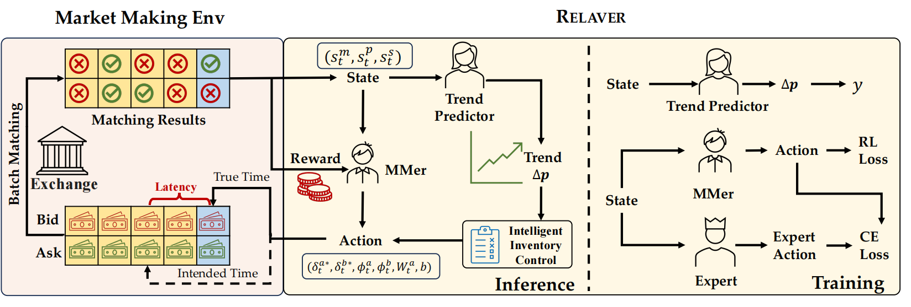
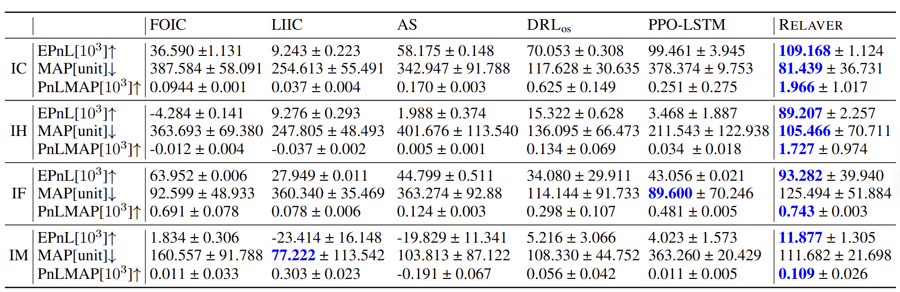
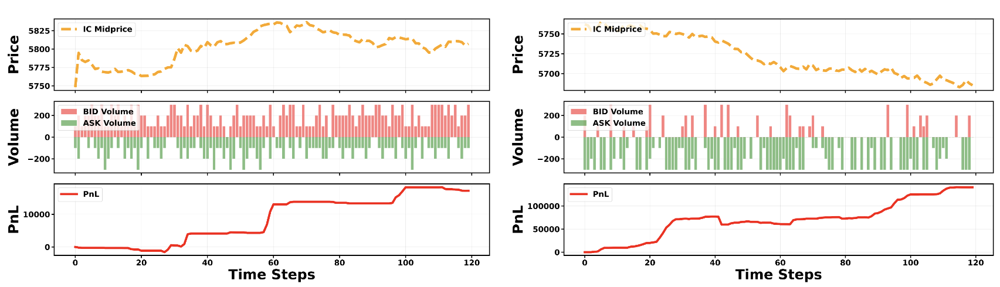

# Relaver: Resolving Latency and Inventory Risk in Market Making with Reinforcement Learning
This repo provides the code for reproducing the stock trading experiments in the IJCAI'25 submission **Resolving Latency and Inventory Risk in Market Making with Reinforcement Learning**. 

 Overview of the Relaver framework




### Dependencies
```
Python: 3.10.13
Stable-Baselines3: 2.3.2
PyTorch: 2.2.1+cpu
GPU Enabled: False
Numpy: 1.26.4
Cloudpickle: 3.0.0
Gymnasium: 0.29.1
OpenAI Gym: 0.26.2
yfinance 0.2.3
finrl 0.3.5 
```

### Usage
We provide the RElaver implementation on four major Chinese stock index option: IC (CSI 500), IF (CSI 300), IH (SSE 50), and IM (CSI 1000). 
To execute the training and evaluation, specify the ``<index optio_name>`` (``IC`` or ``IF``) first and execute st_run.sh:

```shell
st_run.sh --market <market_name>
```
The testing results on four major Chinese stock index option and the corresponding case studies are as follows:





